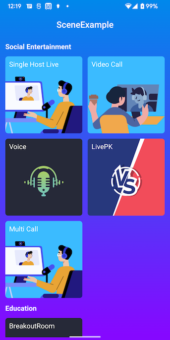

# Android Scenarios demo
_English | [中文](README_zh.md)


## Overview
This repository contains scenarios using the Agora RTC Java SDK for Android.



## Scenarios
|Scene|Location|
|----|----|
|SingleHostLive|[SingleHostLive](./modules/SingleHostLive/)|
|VideoCall|[VideoCall](./modules/VideoCall/)|
|Voice|[Voice](./modules/Voice/)|
|LivePK|[LivePK](./modules/LivePK/)|
|PKLiveByCDN|[PKLiveByCDN](./modules/PKLiveByCDN/)|
|BreakoutRoom|[BreakoutRoom](./modules/BreakoutRoom/)|
|MultiCall|[MultiCall](./modules/MultiCall/)|

## Quickstart
### Prerequisites

- Physical Android device or Android simulator with Android 4.1+
- Android Studio (latest version recommended)
- Agora Rtc SDK (RTC version declare in [config](config.gradle))

### Steps to run

1. In Android Studio, open  `/Android`.
2. Sync the project with Gradle files.
3. Edit the  `/Android/libs/base-library/src/main/res/values/string_config.xml` file.

    - Replace `<=YOUR RTC APP ID=>` with your RTC App ID.
    - Replace `<=YOUR SYNC APP ID=>` with your RTM App ID which can be same with RTC App ID。
    - If the certificate of project opened，the APP Certificate should be set to `rtc_certificate`

   ```xml
   <string name="rtc_app_id" translatable="false"><=YOUR RTC APP ID=></string>
   <string name="rtc_certificate" translatable="false"/>
   <string name="sync_app_id" translatable="false"><=YOUR SYNC APP ID=></string>
   ```

   > See [Get Started with Agora](https://docs.agora.io/en/Agora%20Platform/get_appid_token) to learn how to get an App ID and App Certificate.
   >
   > The project has a server for generating access token，so temporary access token is unnecessary. However, the APP Certificate should be set to `rtc_certificate`.

   > To ensure communication security, Agora uses access tokens (dynamic keys) to authenticate users joining a channel.
   >
   > The server for generating access token in the project is for demonstration and testing purposes only。In a production environment, you need to deploy your own server for generating access tokens. See [Generate a Token](https://docs.agora.io/en/Interactive%20Broadcast/token_server) for details.

4. Make the project and run the app in the simulator or connected physical Android device.

You are all set! Feel free to play with this sample project and explore features of the Agora RTC SDK.

## Feedback

If you have any problems or suggestions regarding the sample projects, feel free to file an issue.

## Reference

- [RTC Java SDK Product Overview](https://docs.agora.io/en/Interactive%20Broadcast/product_live?platform=Android)
- [RTC Java SDK API Reference](https://docs.agora.io/en/Interactive%20Broadcast/API%20Reference/java/index.html)

## Related resources

- Check our [FAQ](https://docs.agora.io/en/faq) to see if your issue has been recorded.
- Dive into [Agora SDK Samples](https://github.com/AgoraIO) to see more tutorials
- Take a look at [Agora Use Case](https://github.com/AgoraIO-usecase) for more complicated real use case
- Repositories managed by developer communities can be found at [Agora Community](https://github.com/AgoraIO-Community)
- If you encounter problems during integration, feel free to ask questions in [Stack Overflow](https://stackoverflow.com/questions/tagged/agora.io)

## License

The sample projects are under the MIT license.