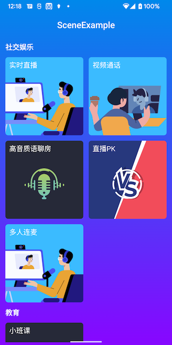

# Android 场景化demo
_[English](README.md) | 中文_


## 简介
该仓库包含了使用 RTC Java SDK for Android 开发的场景实现合集。



## 场景
|场景|工程名称|
|----|----|
|实时直播|[SingleHostLive](./modules/SingleHostLive/)|
|视频通话|[VideoCall](./modules/VideoCall/)|
|高音质语聊房|[Voice](./modules/Voice/)|
|直播PK|[LivePK](./modules/LivePK/)|
|CDN PK|[PKLiveByCDN](./modules/PKLiveByCDN/)|
|超级小班课|[BreakoutRoom](./modules/BreakoutRoom/)|
|多人连麦|[MultiCall](./modules/MultiCall/)|

## 快速上手
### 前提条件

- 真实的 Android 设备或 Android 虚拟机
- Android Studio (推荐最新版)
- Agora Rtc SDK (已集成在gradle配置里，版本见[config](config.gradle))

### 运行步骤

1. 在 Android Studio 中，打开 `/Android`。
2. 将项目与 Gradle 文件同步。
3. 编辑 `/Android/libs/base-library/src/main/res/values/string_config.xml` 文件。

    - 将 `<=YOUR RTC APP ID=>` 替换为你的 RTC App ID。
    - 将 `<=YOUR SYNC APP ID=>` 替换为你的 RTM App ID，可以和RTC App ID一样。
    - 如果开启了token，需要获取 App 证书并设置给`rtc_certificate`

   ```xml
   <string name="rtc_app_id" translatable="false"><=YOUR RTC APP ID=></string>
   <string name="rtc_certificate" translatable="false"/>
   <string name="sync_app_id" translatable="false"><=YOUR SYNC APP ID=></string>
   ```

   > 参考 [开始使用 Agora 平台](https://docs.agora.io/cn/Agora%20Platform/get_appid_token) 了解如何获取 App ID 和 App 证书。
   >
   > 项目里自带Token签发服务，不需要使用临时token，但是需要配置`rtc_certificate`

   > 为提高项目的安全性，Agora 使用 Token（动态密钥）对即将加入频道的用户进行鉴权。
   >
   > 项目里使用的Token签发服务 仅作为演示和测试用途。在生产环境中，你需要自行部署服务器签发 Token，详见[生成 Token](https://docs.agora.io/cn/Interactive%20Broadcast/token_server)。

4. 构建项目，在虚拟器或真实 Android 设备中运行项目。

一切就绪。你可以自由探索示例项目，体验 RTC Java SDK 的丰富功能。

## 反馈

如果你有任何问题或建议，可以通过 issue 的形式反馈。

## 参考文档

- [RTC Java SDK 产品概述](https://docs.agora.io/cn/Interactive%20Broadcast/product_live?platform=Android)
- [RTC Java SDK API 参考](https://docs.agora.io/cn/Interactive%20Broadcast/API%20Reference/java/index.html)

## 相关资源

- 你可以先参阅 [常见问题](https://docs.agora.io/cn/faq)
- 如果你想了解更多官方示例，可以参考 [官方 SDK 示例](https://github.com/AgoraIO)
- 如果你想了解声网 SDK 在复杂场景下的应用，可以参考 [官方场景案例](https://github.com/AgoraIO-usecase)
- 如果你想了解声网的一些社区开发者维护的项目，可以查看 [社区](https://github.com/AgoraIO-Community)
- 若遇到问题需要开发者帮助，你可以到 [开发者社区](https://rtcdeveloper.com/) 提问
- 如果需要售后技术支持, 你可以在 [Agora Dashboard](https://dashboard.agora.io) 提交工单

## 代码许可

示例项目遵守 MIT 许可证。