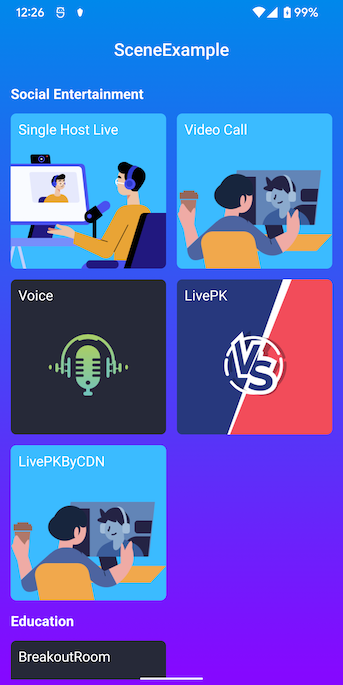

# # iOS Scenarios demo

_English | [中文](README_zh.md)

## Overview

This repository contains scenarios using the Agora RTC SDK for iOS.


## Scenarios

|Scene|Location|
|--|--|
|SingleHostLive|LiveBroadcasting|
|VideoCall|VideoCall|
|Voice|VoiceChatRoom|
|LivePK|LivePK|
|PKLiveByCDN|CDN|
|BreakoutRoom|BreakoutRoom|

## Quickstart

### Prerequisites

- Physical iOS device with iOS 13.0+
- Xcode (latest version recommended)
- Agora Rtc SDK (pod install)

### Steps to run

1. Run `pod install`  in the iOS directory.
2. Open` Scene-Examples.xcworkspace`
3. Edit the  `KeyCenter` file.
   - Replace `<=YOUR APPID=>` with your RTC App ID.
   - Replace `<=YOUR Certificate=>` with your RTC Certificate.
   - If the certificate of project opened，the APP Certificate should be set to `certificate`
      
      ```swift
 
     /**
      Agora assigns App IDs to app developers to identify projects and organizations.
     If you have multiple completely separate apps in your organization, for example built by different teams,
     you should use different App IDs.
     If applications need to communicate with each other, they should use the same App ID.
     In order to get the APP ID, you can open the agora console (https://console.agora.io/) to create a project,
     then the APP ID can be found in the project detail page.
     */
     static let AppId: String = <# YOUR APPID#>
     
     /**
      Agora provides App certificate to generate Token. You can deploy and generate a token on your server,
     or use the console to generate a temporary token.
     In order to get the APP ID, you can open the agora console (https://console.agora.io/) to create a project with the App Certificate enabled,
     then the APP Certificate can be found in the project detail page.
     PS: If the project does not have certificates enabled, leave this field blank.
     */
     static var Certificate: String? = <#YOUR Certificate#>
   ```
   > See [Get Started with Agora](https://docs.agora.io/en/Agora%20Platform/get_appid_token) to learn how to get an App ID and App Certificate.
   > 
   > The project has a server for generating access token，so temporary access token is unnecessary. However, the APP Certificate should be set to `rtc_app_certificate` and `rtm_app_certificate`.
   > To ensure communication security, Agora uses access tokens (dynamic keys) to authenticate users joining a channel.
   > 
   > The server for generating access token in the project is for demonstration and testing purposes only。In a production environment, you need to deploy your own server for generating access tokens. See [Generate a Token](https://docs.agora.io/en/Interactive%20Broadcast/token_server) for details.
4. Make the project and run the app in physical iOS device.

## Feedback

If you have any problems or suggestions regarding the sample projects, feel free to file an issue.

## Reference

- [RTC iOS SDK Product Overview](https://docs.agora.io/en/Interactive%20Broadcast/product_live?platform=iOS)
- [RTC iOS SDK API Reference](https://docs.agora.io/en/Interactive%20Broadcast/API%20Reference/oc/docs/headers/Agora-Objective-C-API-Overview.html)

## Related resources

- Check our [FAQ](https://docs.agora.io/en/faq) to see if your issue has been recorded.
- Dive into [Agora SDK Samples](https://github.com/AgoraIO) to see more tutorials
- Take a look at [Agora Use Case](https://github.com/AgoraIO-usecase) for more complicated real use case
- Repositories managed by developer communities can be found at [Agora Community](https://github.com/AgoraIO-Community)
- If you encounter problems during integration, feel free to ask questions in [Stack Overflow](https://stackoverflow.com/questions/tagged/agora.io)

## License

The sample projects are under the MIT license.
