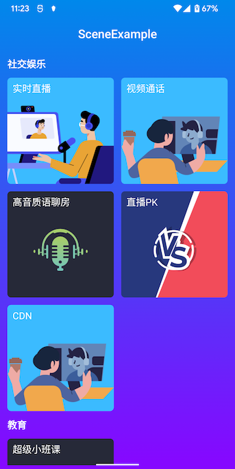

# iOS 场景化demo

_[English](README.md) | 中文_

## 简介

该仓库包含了使用 RTC SDK for iOS 开发的场景实现合集。


## 场景

|场景|工程名称|
|--|--|
|实时直播|LiveBroadcasting|
|视频通话|VideoCall|
|高音质语聊房|VoiceChatRoom|
|直播PK|LivePK|
|CDN PK|CDN|
|超级小班课|BreakoutRoom|

## 快速上手

### 前提条件

- iOS 真机
- Xcode 13.0 (推荐最新版)
- Agora Rtc SDK (pod install)

### 运行步骤

1. 在iOS目录下, 执行 `pod install`。
2. 打开`Scene-Examples.xcworkspace`项目
3. 编辑 `KeyCenter.swift文件`
    - 将 `<=YOUR APPID=>` 替换为你的 RTC App ID。
    - 将 `<=YOUR Certificate=>` 替换为你的 RTC Certificate
    - 如果开启了token，需要获取 App 证书并设置给`certificate`

   ```swift
   /**
     Agora 给应用程序开发人员分配 App ID，以识别项目和组织。如果组织中有多个完全分开的应用程序，例如由不同的团队构建，
     则应使用不同的 App ID。如果应用程序需要相互通信，则应使用同一个App ID。
     进入声网控制台(https://console.agora.io/)，创建一个项目，进入项目配置页，即可看到APP ID。
   */
    static let AppId: String = <# YOUR APPID#>

    /**
     Agora 提供 App certificate 用以生成 Token。您可以在您的服务器部署并生成 Token，或者使用控制台生成临时的 Token。
     进入声网控制台(https://console.agora.io/)，创建一个带证书鉴权的项目，进入项目配置页，即可看到APP证书。
     注意：如果项目没有开启证书鉴权，这个字段留空。
    */
    static var Certificate: String? = <#YOUR Certificate#>
   ```
   > 参考 [开始使用 Agora 平台](https://docs.agora.io/cn/Agora%20Platform/get_appid_token) 了解如何获取 App ID 和 App 证书。
   > 
   > 项目里自带Token签发服务，不需要使用临时token，但是需要配置`rtc_app_certificate`和`rtm_app_certificate`
   > 为提高项目的安全性，Agora 使用 Token（动态密钥）对即将加入频道的用户进行鉴权。
   > 
   > 项目里使用的Token签发服务 仅作为演示和测试用途。在生产环境中，你需要自行部署服务器签发 Token，详见[生成 Token](https://docs.agora.io/cn/Interactive%20Broadcast/token_server)。
4. 使用真机运行。

## 反馈

如果你有任何问题或建议，可以通过 issue 的形式反馈。

## 参考文档

- [RTC iOS SDK 产品概述](https://docs.agora.io/cn/Interactive%20Broadcast/product_live?platform=iOS)
- [RTC iOS SDK API 参考](https://docs.agora.io/cn/Interactive%20Broadcast/API%20Reference/oc/docs/headers/Agora-Objective-C-API-Overview.html)

## 相关资源

- 你可以先参阅 [常见问题](https://docs.agora.io/cn/faq)
- 如果你想了解更多官方示例，可以参考 [官方 SDK 示例](https://github.com/AgoraIO)
- 如果你想了解声网 SDK 在复杂场景下的应用，可以参考 [官方场景案例](https://github.com/AgoraIO-usecase)
- 如果你想了解声网的一些社区开发者维护的项目，可以查看 [社区](https://github.com/AgoraIO-Community)
- 若遇到问题需要开发者帮助，你可以到 [开发者社区](https://rtcdeveloper.com/) 提问
- 如果需要售后技术支持, 你可以在 [Agora Dashboard](https://dashboard.agora.io) 提交工单

## 代码许可

示例项目遵守 MIT 许可证。
